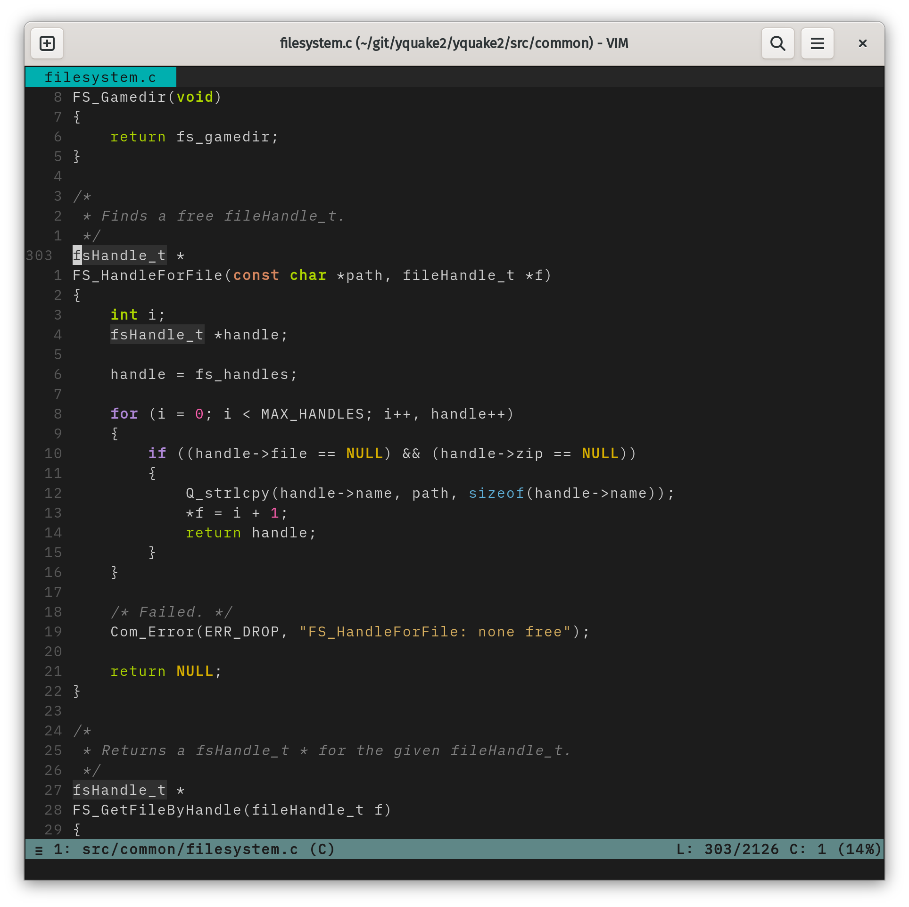

# Kiwi Mono

Kiwi Mono is a monospace font based upon
[IBM Plex Mono](https://github.com/IBM/plex)
and
[iA Writer Mono S](https://github.com/iaolo/iA-Fonts)
with Powerline symbols. It is optimized to handle source code, longer
texts like prose and terminal output.

This repositories holds the FontForge project. A ready to use TrueType
font can be found in the release section.
